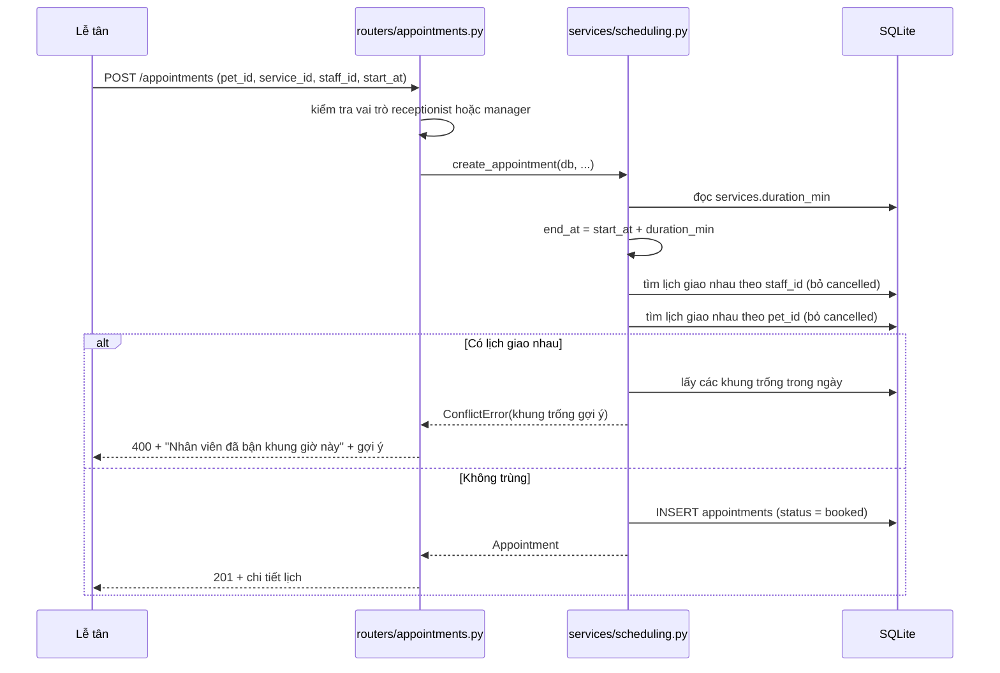
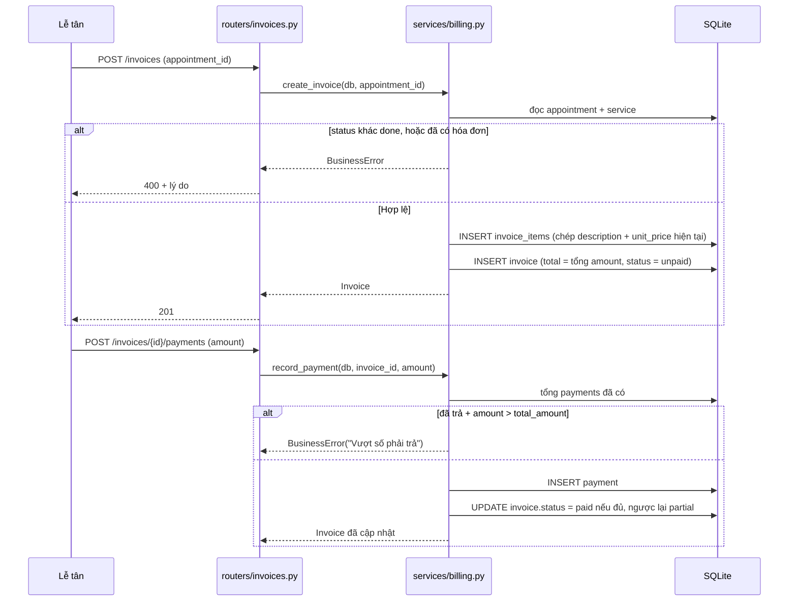
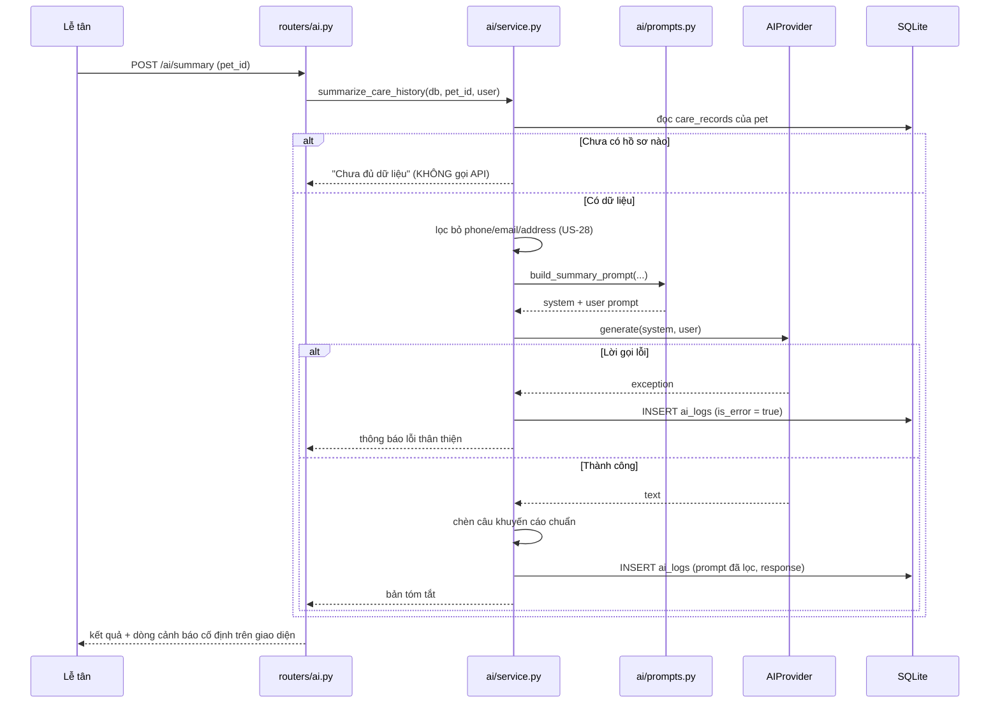

# Kiến trúc hệ thống

Yêu cầu: [`user-stories.md`](user-stories.md) · Dữ liệu: [`erd.md`](erd.md) · Kiểm thử: [`testing/test-strategy.md`](testing/test-strategy.md)

## Stack

| Thành phần | Công nghệ | Lý do chọn |
|---|---|---|
| Backend | FastAPI + SQLAlchemy | Validation sẵn qua Pydantic, `TestClient` sẵn có nên viết integration test rẻ |
| CSDL | SQLite (`petcare.db`) | Một file, không cần cài server, chép đi đâu cũng chạy |
| Frontend | Jinja2 + HTML/JS thuần | Không build tool, không `npm`; mỗi màn hình một template dễ sửa |
| AI | Gemini API sau adapter | Đổi nhà cung cấp chỉ thêm một file; test chạy offline bằng `FakeProvider` |
| Test | pytest | Chuẩn của hệ sinh thái Python |

Không dùng Docker, không dùng SPA, không dùng lớp repository. Mỗi thứ bị loại đều vì cùng một lý do:
chúng thêm một tầng phải bảo trì mà không giải quyết vấn đề nào trong đề bài này.

## Cây thư mục

```
hethongquanlythucung/
├── app/
│   ├── main.py              khởi tạo FastAPI, đăng ký router, tạo bảng lần đầu
│   ├── config.py            đọc .env: DATABASE_URL, AI_PROVIDER, GEMINI_API_KEY, SECRET_KEY
│   ├── db.py                engine, SessionLocal, get_db()
│   ├── security.py          băm mật khẩu, session cookie, dependency kiểm tra vai trò
│   ├── models/              SQLAlchemy — 13 bảng, mỗi nhóm một file
│   ├── services/            LOGIC NGHIỆP VỤ — không import gì từ FastAPI
│   │   ├── scheduling.py    đặt/đổi/hủy lịch, kiểm tra trùng lịch
│   │   ├── billing.py       lập hóa đơn, ghi nhận thanh toán
│   │   └── stats.py         lượt dịch vụ, doanh thu, khách quay lại
│   ├── ai/
│   │   ├── provider.py      interface AIProvider
│   │   ├── gemini.py        GeminiProvider — gọi API thật
│   │   ├── fake.py          FakeProvider — trả lời cố định, dùng khi test
│   │   ├── prompts.py       system prompt + câu khuyến cáo chuẩn
│   │   └── service.py       3 use case: reminder, summary, qa
│   ├── routers/             chỉ HTTP: auth, owners, pets, services, appointments,
│   │                        care_records, vaccinations, invoices, stats, ai
│   ├── templates/           Jinja2
│   └── static/              CSS, JS
├── tests/
│   ├── conftest.py          fixture dùng chung
│   ├── unit/                test services/ và ai/prompts.py
│   ├── integration/         test qua TestClient + SQLite in-memory
│   └── e2e/test_full_flow.py  một kịch bản xuyên suốt trên DB file thật
├── docs/
└── .claude/                 hook ghi log phiên (xem CLAUDE.md mục 6)
```

## Ba lớp và ranh giới giữa chúng

```
HTTP  →  routers/  →  services/  →  models/  →  SQLite
                          ↓
                        ai/service.py  →  ai/provider.py  →  Gemini API
```

**`routers/` — chỉ làm HTTP.** Nhận request, kiểm tra quyền, gọi một hàm trong `services/`, render
template hoặc trả JSON. Không có phép tính nghiệp vụ nào ở đây.

**`services/` — toàn bộ logic nghiệp vụ.** Nhận `Session` của SQLAlchemy và tham số thuần Python,
trả về đối tượng hoặc ném exception nghiệp vụ. **Không import `fastapi`.** Nhờ vậy gọi trực tiếp
được trong unit test mà không cần khởi động app.

**`models/` — chỉ định nghĩa bảng và quan hệ.** Không chứa logic nghiệp vụ.

**`ai/` — cô lập nhà cung cấp.** Router không bao giờ gọi thẳng `gemini.py`; mọi lời gọi đi qua
`ai/service.py`, nơi dựng prompt, lọc dữ liệu cá nhân, chèn khuyến cáo và ghi `ai_logs`.

### Vì sao ranh giới này quan trọng

Ranh giới `routers/` ↔ `services/` là **điều kiện để tầng unit test tồn tại**. Nếu quy tắc trùng
lịch nằm trong hàm router, cách duy nhất để test là dựng HTTP request, tạo phiên đăng nhập, chuẩn bị
dữ liệu qua API — chậm, và khi test đỏ thì không biết lỗi ở tầng nào. Cùng quy tắc đó nằm trong
`scheduling.py` thì test chỉ cần vài dòng, chạy trong mili giây, và đỏ ở đâu là biết ngay ở đó.

Đây cũng là lý do bỏ lớp repository: SQLAlchemy `Session` đã là lớp trừu tượng trên CSDL rồi, thêm
một tầng nữa chỉ để "cho đúng kiến trúc" là vi phạm nguyên tắc 2 trong [`../CLAUDE.md`](../CLAUDE.md).

## Xử lý lỗi

Ba nhóm, ba cách xử lý khác nhau:

| Nhóm | Ví dụ | Cách xử lý |
|---|---|---|
| Lỗi nhập liệu | Thiếu tên, cân nặng âm | FastAPI bắt thiếu trường ở `Form(...)` → 422; sai giá trị thì `services/` ném `LoiNghiepVu`, router render lại trang với mã 400 và thông báo tiếng Việt |
| Lỗi nghiệp vụ | Trùng lịch, hủy lịch đã có hóa đơn | `services/` ném exception riêng, router bắt và trả 400 kèm thông báo tiếng Việt |
| Lỗi hạ tầng | Gemini hết quota, mất mạng | `ai/service.py` bắt, ghi `ai_logs` với `is_error = true`, trả thông báo lỗi thân thiện. **Trang không được vỡ** (US-24) |

Nguyên tắc: lỗi AI không bao giờ được làm hỏng chức năng quản lý. Không sinh được tin nhắn nhắc lịch
thì lễ tân vẫn tự viết được — lịch hẹn vẫn nguyên vẹn.

---

## Luồng 1 — Đặt lịch có kiểm tra trùng



Điểm cần chú ý khi cài đặt: phép so sánh giao nhau là `A.start < B.end AND B.start < A.end`. Dùng
`<=` sẽ khiến hai lịch liền kề 09:00–10:00 và 10:00–11:00 bị coi là trùng — đây chính là ca US-11
dòng 2 bắt được.

## Luồng 2 — Lập hóa đơn và thanh toán



Đơn giá được **chép** vào `invoice_items.unit_price` chứ không tham chiếu `services.price`. Nhờ vậy
đổi bảng giá không làm sai hóa đơn cũ (US-07).

## Luồng 3 — AI tóm tắt hồ sơ chăm sóc



Dòng cảnh báo "AI không thay thế bác sĩ thú y" nằm trong **template**, không nằm trong phản hồi AI.
Nhờ vậy nó hiện kể cả khi lời gọi AI thất bại (US-26).

`AIProvider` là một interface một hàm:

```python
class AIProvider(Protocol):
    def generate(self, system: str, user: str) -> str: ...
```

`GeminiProvider` gọi API thật; `FakeProvider` trả chuỗi cố định có chứa câu khuyến cáo. `config.py`
chọn implementation theo biến `AI_PROVIDER`. Toàn bộ test chạy với `FakeProvider` — không tốn quota,
không cần mạng, kết quả tất định.

---

## Chiến lược test ở góc nhìn kiến trúc

Chi tiết đầy đủ trong [`testing/test-strategy.md`](testing/test-strategy.md). Ba điều kiến trúc phải
bảo đảm để test khả thi:

1. **`services/` không import `fastapi`** → unit test gọi hàm trực tiếp với một `Session` in-memory.
2. **`get_db` và `AIProvider` là dependency** → integration test thay bằng SQLite in-memory và
   `FakeProvider` chỉ bằng `app.dependency_overrides`, không cần monkeypatch sâu.
3. **Thời gian lấy qua một hàm duy nhất** (`services/clock.py` hoặc tương đương) → test đặt được
   "hôm nay" là ngày cố định, nhờ vậy ca "đặt lịch trong quá khứ" và "đến hạn tiêm trong 30 ngày"
   không phụ thuộc ngày chạy test.

Điều 3 là ranh giới ngoài duy nhất, ngoài API Gemini, được phép mock theo luật trong
[`../CLAUDE.md`](../CLAUDE.md) mục 7.
