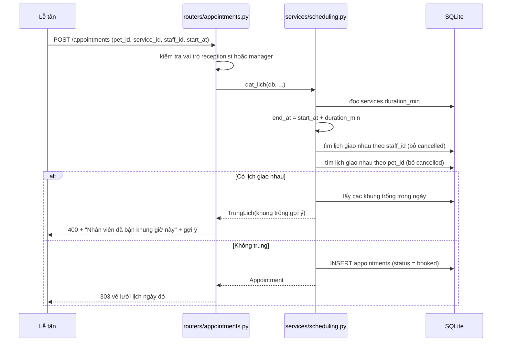
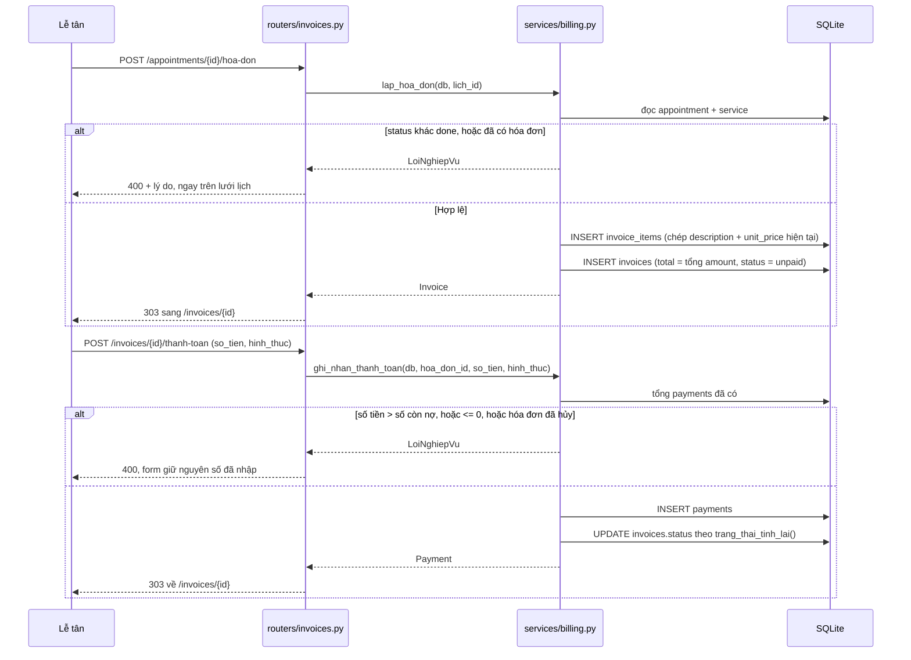
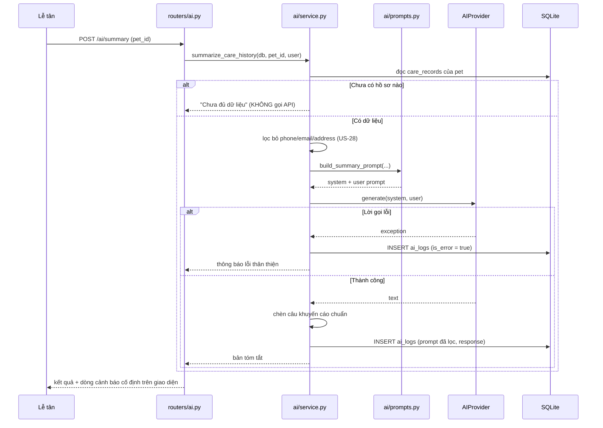

# Kiến trúc hệ thống

Yêu cầu: [`user-stories/README.md`](user-stories/README.md) · Dữ liệu: [`erd.md`](erd.md) · Kiểm thử: [`testing/test-strategy.md`](testing/test-strategy.md)

## Stack

| Thành phần | Công nghệ | Lý do chọn |
|---|---|---|
| Backend | FastAPI + SQLAlchemy | Validation sẵn qua Pydantic, `TestClient` sẵn có nên viết integration test rẻ |
| CSDL | SQLite (`petcare.db`) | Một file, không cần cài server, chép đi đâu cũng chạy |
| Frontend | Jinja2 + HTML/JS thuần | Không build tool, không `npm`; mỗi màn hình một template dễ sửa |
| AI | Gemini API sau adapter | Đổi nhà cung cấp chỉ thêm một file; test chạy offline bằng `FakeProvider` |
| Test | pytest | Chuẩn của hệ sinh thái Python |

Không dùng Docker, không dùng SPA, không dùng lớp repository. Mỗi thứ bị loại đều vì cùng một lý do:
chúng thêm một tầng phải bảo trì mà không giải quyết vấn đề nào trong đề bài này.

## Cây thư mục

```
hethongquanlythucung/
├── app/
│   ├── main.py              khởi tạo FastAPI, đăng ký router, tạo bảng lần đầu
│   ├── config.py            đọc .env: DATABASE_URL, AI_PROVIDER, GEMINI_API_KEY, SECRET_KEY
│   ├── db.py                engine, SessionLocal, get_db()
│   ├── security.py          băm mật khẩu (bcrypt)
│   ├── auth.py              session cookie, người dùng hiện tại, dependency kiểm tra vai trò
│   ├── templates.py         cấu hình Jinja2 dùng chung
│   ├── seed.py              dữ liệu mẫu: python -m app.seed
│   ├── models/              SQLAlchemy — 16 bảng theo ERD, mỗi nhóm một file
│   ├── services/            LOGIC NGHIỆP VỤ — không import gì từ FastAPI
│   │   ├── scheduling.py    đặt/đổi/hủy lịch, kiểm tra trùng lịch
│   │   ├── billing.py       lập hóa đơn, ghi nhận thanh toán
│   │   ├── stats.py         lượt dịch vụ, doanh thu, khách quay lại
│   │   └── …                users, owners, catalog, care_records, vaccinations, clock, text, errors
│   ├── ai/                  TẦNG AI — router chỉ được import service.py
│   │   ├── provider.py      interface AIProvider + 5 lớp lỗi đã phân loại
│   │   ├── gemini.py        GeminiProvider — gọi REST bằng urllib
│   │   ├── fake.py          FakeProvider — cài được lỗi theo từng model, dùng khi test
│   │   ├── prompts.py       system prompt + câu khuyến cáo chuẩn
│   │   ├── guardrail.py     chặn câu xin thuốc, soát liều lượng, xóa SĐT/email
│   │   ├── quota.py         xoay ca model, đếm lượt theo ngày Pacific + CLI
│   │   └── service.py       3 use case: reminder, summary, qa
│   ├── mail/                GỬI EMAIL (P9 chặng 3) — router chỉ import service.py
│   │   ├── provider.py      interface GuiMail + LoiGuiMail
│   │   ├── smtp.py          SmtpMailer — smtplib thư viện chuẩn, STARTTLS
│   │   ├── console.py       ConsoleMailer — in thư ra log, cho máy phát triển
│   │   ├── fake.py          FakeMailer — dùng khi test, không thư nào ra khỏi tiến trình
│   │   └── service.py       lay_mailer() chọn theo MAIL_PROVIDER
│   ├── routers/             chỉ HTTP: auth, users, owners, pets, services, appointments,
│   │                        care_records, vaccinations, invoices, stats, ai,
│   │                        khach_auth, khach_lien_ket, khach_du_lieu (cổng khách, prefix /khach — phiên riêng, không dùng chung dependency nhân viên; `khach_du_lieu` chỉ gọi `services/khach_du_lieu.py`, có phép canh AST),
│   │                        lien_ket_khach (màn hình lễ tân duyệt nối khách với hồ sơ chủ nuôi)
│   ├── templates/           Jinja2 (JS ít, viết thẳng trong trang cần tới)
│   └── static/              style.css — một file CSS, không có file JS riêng
├── tests/
│   ├── conftest.py          fixture dùng chung
│   ├── unit/                test services/ và ai/ (prompts, guardrail, quota, service, gemini)
│   ├── integration/         test qua TestClient + SQLite in-memory
│   └── e2e/test_full_flow.py  một kịch bản xuyên suốt trên DB file thật
├── docs/
└── .claude/                 hook ghi log phiên (xem CLAUDE.md mục 6)
```

## Ba lớp và ranh giới giữa chúng

```
HTTP  →  routers/  →  services/  →  models/  →  SQLite
                          ↓
                        ai/service.py  →  ai/provider.py  →  Gemini API
```

**`routers/` — chỉ làm HTTP.** Nhận request, kiểm tra quyền, gọi một hàm trong `services/`, render
template hoặc trả JSON. Không có phép tính nghiệp vụ nào ở đây.

**`services/` — toàn bộ logic nghiệp vụ.** Nhận `Session` của SQLAlchemy và tham số thuần Python,
trả về đối tượng hoặc ném exception nghiệp vụ. **Không import `fastapi`.** Nhờ vậy gọi trực tiếp
được trong unit test mà không cần khởi động app.

**`models/` — chỉ định nghĩa bảng và quan hệ.** Không chứa logic nghiệp vụ.

**`ai/` — cô lập nhà cung cấp.** Router không bao giờ gọi thẳng `gemini.py`; mọi lời gọi đi qua
`ai/service.py`, nơi dựng prompt, lọc dữ liệu cá nhân, chèn khuyến cáo và ghi `ai_logs`.

### Vì sao ranh giới này quan trọng

Ranh giới `routers/` ↔ `services/` là **điều kiện để tầng unit test tồn tại**. Nếu quy tắc trùng
lịch nằm trong hàm router, cách duy nhất để test là dựng HTTP request, tạo phiên đăng nhập, chuẩn bị
dữ liệu qua API — chậm, và khi test đỏ thì không biết lỗi ở tầng nào. Cùng quy tắc đó nằm trong
`scheduling.py` thì test chỉ cần vài dòng, chạy trong mili giây, và đỏ ở đâu là biết ngay ở đó.

Đây cũng là lý do bỏ lớp repository: SQLAlchemy `Session` đã là lớp trừu tượng trên CSDL rồi, thêm
một tầng nữa chỉ để "cho đúng kiến trúc" là vi phạm nguyên tắc 2 trong [`../CLAUDE.md`](../CLAUDE.md).

## Xử lý lỗi

Ba nhóm, ba cách xử lý khác nhau:

| Nhóm | Ví dụ | Cách xử lý |
|---|---|---|
| Lỗi nhập liệu | Thiếu tên, cân nặng âm | FastAPI bắt thiếu trường ở `Form(...)` → 422; sai giá trị thì `services/` ném `LoiNghiepVu`, router render lại trang với mã 400 và thông báo tiếng Việt |
| Lỗi nghiệp vụ | Trùng lịch, hủy lịch đã có hóa đơn | `services/` ném exception riêng, router bắt và trả 400 kèm thông báo tiếng Việt |
| Không tìm thấy bản ghi | Mở trang xóa của thú cưng người khác vừa xóa | `services/` ném `LoiKhongTimThay` (lớp con của `LoiNghiepVu`). Router không bắt thì trình xử lý chung trong `main.py` đổi thành trang 404 tiếng Việt; `LoiNghiepVu` nào khác lọt ra thành trang 400. **Không lỗi nghiệp vụ nào được thành 500** (sửa 19/09, TC-115) |
| Ghi đồng thời | Hai máy thu tiền cùng một hóa đơn | `billing.ghi_nhan_thanh_toan` giành khóa ghi trên dòng hóa đơn trước khi đọc số còn nợ — pysqlite không mở transaction cho `SELECT` nên đọc-rồi-ghi không tự an toàn (sửa 19/09, TC-113) |
| Lỗi hạ tầng | Gemini hết quota, mất mạng | `ai/service.py` bắt, ghi `ai_logs` với `is_error = true`, trả thông báo lỗi thân thiện. **Trang không được vỡ** (US-24) |

Nguyên tắc: lỗi AI không bao giờ được làm hỏng chức năng quản lý. Không sinh được tin nhắn nhắc lịch
thì lễ tân vẫn tự viết được — lịch hẹn vẫn nguyên vẹn.

---

## Luồng 1 — Đặt lịch có kiểm tra trùng


```mermaid
sequenceDiagram
    participant LT as Lễ tân
    participant R as routers/appointments.py
    participant S as services/scheduling.py
    participant DB as SQLite

    LT->>R: POST /appointments (pet_id, service_id, staff_id, start_at)
    R->>R: kiểm tra vai trò receptionist hoặc manager
    R->>S: dat_lich(db, ...)
    S->>DB: đọc services.duration_min
    S->>S: end_at = start_at + duration_min
    S->>DB: tìm lịch giao nhau theo staff_id (bỏ cancelled)
    S->>DB: tìm lịch giao nhau theo pet_id (bỏ cancelled)
    alt Có lịch giao nhau
        S->>DB: lấy các khung trống trong ngày
        S-->>R: TrungLich(khung trống gợi ý)
        R-->>LT: 400 + "Nhân viên đã bận khung giờ này" + gợi ý
    else Không trùng
        S->>DB: INSERT appointments (status = booked)
        S-->>R: Appointment
        R-->>LT: 303 về lưới lịch ngày đó
    end
```

Điểm cần chú ý khi cài đặt: phép so sánh giao nhau là `A.start < B.end AND B.start < A.end`. Dùng
`<=` sẽ khiến hai lịch liền kề 09:00–10:00 và 10:00–11:00 bị coi là trùng — đây chính là ca US-11
dòng 2 bắt được.

## Luồng 2 — Lập hóa đơn và thanh toán


```mermaid
sequenceDiagram
    participant LT as Lễ tân
    participant R as routers/invoices.py
    participant B as services/billing.py
    participant DB as SQLite

    LT->>R: POST /appointments/{id}/hoa-don
    R->>B: lap_hoa_don(db, lich_id)
    B->>DB: đọc appointment + service
    alt status khác done, hoặc đã có hóa đơn
        B-->>R: LoiNghiepVu
        R-->>LT: 400 + lý do, ngay trên lưới lịch
    else Hợp lệ
        B->>DB: INSERT invoice_items (chép description + unit_price hiện tại)
        B->>DB: INSERT invoices (total = tổng amount, status = unpaid)
        B-->>R: Invoice
        R-->>LT: 303 sang /invoices/{id}
    end

    LT->>R: POST /invoices/{id}/thanh-toan (so_tien, hinh_thuc)
    R->>B: ghi_nhan_thanh_toan(db, hoa_don_id, so_tien, hinh_thuc)
    B->>DB: tổng payments đã có
    alt số tiền > số còn nợ, hoặc <= 0, hoặc hóa đơn đã hủy
        B-->>R: LoiNghiepVu
        R-->>LT: 400, form giữ nguyên số đã nhập
    else
        B->>DB: INSERT payments
        B->>DB: UPDATE invoices.status theo trang_thai_tinh_lai()
        B-->>R: Payment
        R-->>LT: 303 về /invoices/{id}
    end
```

Đơn giá được **chép** vào `invoice_items.unit_price` chứ không tham chiếu `services.price`. Nhờ vậy
đổi bảng giá không làm sai hóa đơn cũ (US-07).

Việc **lập** hóa đơn nằm ở `routers/appointments.py` chứ không ở `routers/invoices.py`: nó xuất phát
từ một dòng trên lưới lịch hẹn, và khi bị từ chối thì phải quay về đúng lưới ngày đó kèm thông báo.
Cột `invoices.status` chỉ được ghi ở `services/billing.py` — có phép canh trong
`tests/unit/test_architecture.py` giữ luật đó.

## Luồng 3 — AI tóm tắt hồ sơ chăm sóc


```mermaid
sequenceDiagram
    participant LT as Lễ tân
    participant R as routers/ai.py
    participant AS as ai/service.py
    participant P as ai/prompts.py
    participant PR as AIProvider
    participant DB as SQLite

    LT->>R: POST /ai/summary (pet_id)
    R->>AS: summarize_care_history(db, pet_id, user)
    AS->>DB: đọc care_records của pet
    alt Chưa có hồ sơ nào
        AS-->>R: "Chưa đủ dữ liệu" (KHÔNG gọi API)
    else Có dữ liệu
        AS->>AS: lọc bỏ phone/email/address (US-28)
        AS->>P: build_summary_prompt(...)
        P-->>AS: system + user prompt
        AS->>PR: generate(system, user)
        alt Lời gọi lỗi
            PR-->>AS: exception
            AS->>DB: INSERT ai_logs (is_error = true)
            AS-->>R: thông báo lỗi thân thiện
        else Thành công
            PR-->>AS: text
            AS->>AS: chèn câu khuyến cáo chuẩn
            AS->>DB: INSERT ai_logs (prompt đã lọc, response)
            AS-->>R: bản tóm tắt
        end
    end
    R-->>LT: kết quả + dòng cảnh báo cố định trên giao diện
```

Dòng cảnh báo "AI không thay thế bác sĩ thú y" nằm trong **template**, không nằm trong phản hồi AI.
Nhờ vậy nó hiện kể cả khi lời gọi AI thất bại (US-26).

`AIProvider` là một interface một hàm:

```python
class AIProvider(Protocol):
    def generate(self, system: str, user: str) -> str: ...
```

`GeminiProvider` gọi API thật; `FakeProvider` trả chuỗi cố định có chứa câu khuyến cáo. `config.py`
chọn implementation theo biến `AI_PROVIDER`. Toàn bộ test chạy với `FakeProvider` — không tốn quota,
không cần mạng, kết quả tất định.

---

## Bảo mật cho việc công khai (chặng 0.5, 02/10)

Ứng dụng từng chỉ chạy ở quầy nên chưa cần các lớp này; khi mở cổng cho khách (P9) chúng bắt buộc.
Lớp ngoài cùng đi vào trước (thứ tự đăng ký trong `app/main.py`, lớp đăng ký sau nằm ngoài):

| Lớp | Việc | Ở đâu |
|---|---|---|
| `them_header_bao_mat` | `X-Frame-Options`, `X-Content-Type-Options`, `Referrer-Policy` trên **mọi** phản hồi (R-4) | `app/main.py` |
| `khong_luu_dem` | `Cache-Control: no-store` trừ `/static` (L-02) | `app/main.py` |
| `chan_cheo_nguon` | 403 cho yêu cầu ghi từ trang web khác (R-2); quyết định nằm ở hàm thuần `la_post_cheo_nguon` | `app/main.py`, `app/security.py` |
| `SessionMiddleware` | cookie ký bằng `SECRET_KEY`; cờ `Secure` theo `SESSION_HTTPS_ONLY` | `app/main.py` |
| `/login` | giới hạn đăng nhập sai theo cặp (IP, tên đăng nhập), trễ tăng dần, trong bộ nhớ (R-1) | `app/routers/auth.py`, `app/services/login_throttle.py` |
| `nguoi_dung_hien_tai_hoac_none` | cookie phải mang `sv` bằng `users.session_version` (R-3) | `app/auth.py` |

Hai điều cần nhớ khi đụng vào:

- **Phiên là cookie ký, không lưu ở máy chủ.** Muốn thu hồi cookie đã phát phải đổi `session_version`
  (`services/users.thu_hoi_phien`). Đăng xuất vì thế đăng xuất **mọi thiết bị** của tài khoản đó — đánh đổi chấp nhận được
  với ứng dụng này, đổi lấy việc không cần bảng phiên.
- **Bộ đếm đăng nhập sai nằm trong bộ nhớ tiến trình**: khởi động lại là mất, chạy nhiều worker là mỗi worker đếm riêng.
  Đúng với SQLite một tiến trình hiện tại; phải làm lại nếu đổi sang nhiều worker.

CSDL cũ không có cột mới: `create_all` chỉ tạo bảng thiếu. `services/schema.nang_cap_schema` thêm cột thiếu
khi khởi động (xem `lifespan`).

---

## Chiến lược test ở góc nhìn kiến trúc

Chi tiết đầy đủ trong [`testing/test-strategy.md`](testing/test-strategy.md). Ba điều kiến trúc phải
bảo đảm để test khả thi:

1. **`services/` không import `fastapi`** → unit test gọi hàm trực tiếp với một `Session` in-memory.
2. **`get_db` và `AIProvider` là dependency** → integration test thay bằng SQLite in-memory và
   `FakeProvider` chỉ bằng `app.dependency_overrides`, không cần monkeypatch sâu.
3. **Thời gian lấy qua một hàm duy nhất** (`services/clock.py` hoặc tương đương) → test đặt được
   "hôm nay" là ngày cố định, nhờ vậy ca "đặt lịch trong quá khứ" và "đến hạn tiêm trong 30 ngày"
   không phụ thuộc ngày chạy test.

Điều 3 là ranh giới ngoài duy nhất, ngoài API Gemini, được phép mock theo luật trong
[`../CLAUDE.md`](../CLAUDE.md) mục 7.

## Triển khai

Ngoài ranh giới ba lớp, ứng dụng có ba cách chạy (venv, Docker, công khai qua tunnel HTTPS) đều đi qua
`run.py`; luật "chế độ công khai từ chối khởi động khi còn mật khẩu mẫu" nằm ở `lifespan` trong
`app/main.py` chứ không ở `run.py`, để chạy `uvicorn` thẳng cũng không lách được. Chi tiết:
[`trien-khai.md`](trien-khai.md).
