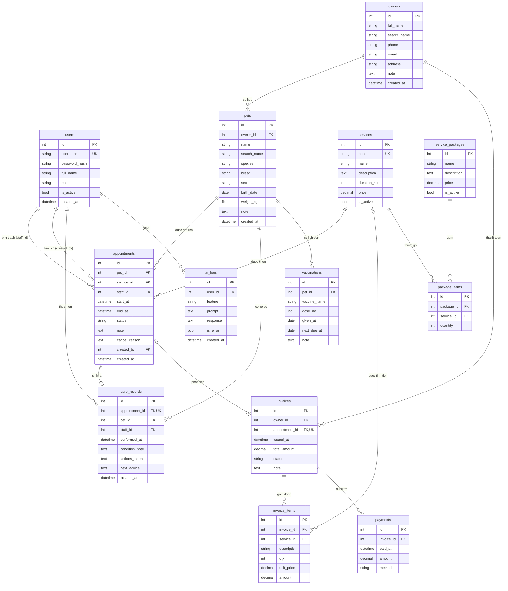

# Mô hình dữ liệu (ERD)

Nguồn yêu cầu: [`user-stories.md`](user-stories.md) · Kiến trúc: [`architecture.md`](architecture.md)

13 bảng. Tên bảng và tên cột dùng tiếng Anh không dấu theo quy ước trong [`../CLAUDE.md`](../CLAUDE.md).
Mọi bảng đều có `id` khóa chính tự tăng.

## Sơ đồ

Ký hiệu lực lượng quan hệ: `||` đúng một · `|o` không hoặc một · `o{` không hoặc nhiều.
Cột khóa ngoài cho phép NULL thì phía thực thể cha là `|o`, không phải `||`.

---

## Mô tả từng bảng

### `users` — tài khoản nhân viên
Phục vụ US-01, US-02, US-03.

| Cột | Kiểu | Ràng buộc | Ý nghĩa |
|---|---|---|---|
| `id` | int | PK | |
| `username` | varchar(50) | NOT NULL, UNIQUE | Tên đăng nhập |
| `password_hash` | varchar(255) | NOT NULL | Chuỗi băm. **Không bao giờ lưu mật khẩu gốc** |
| `full_name` | varchar(100) | NOT NULL | Tên hiển thị |
| `role` | varchar(20) | NOT NULL, CHECK | `manager` \| `receptionist` \| `caretaker` |
| `is_active` | bool | NOT NULL, mặc định `true` | Khóa tài khoản thay vì xóa, để giữ lịch sử (US-03) |
| `created_at` | datetime | NOT NULL | |

### `owners` — chủ nuôi
Phục vụ US-04, US-06, US-23.

| Cột | Kiểu | Ràng buộc | Ý nghĩa |
|---|---|---|---|
| `id` | int | PK | |
| `full_name` | varchar(100) | NOT NULL | |
| `phone` | varchar(20) | NOT NULL, INDEX | Tra cứu tại quầy theo số điện thoại |
| `email` | varchar(120) | NULL | |
| `address` | varchar(255) | NULL | |
| `note` | text | NULL | |
| `created_at` | datetime | NOT NULL | |
| `search_name` | varchar(100) | NOT NULL, INDEX | Bản bỏ dấu và thường hóa của `full_name`, cho tìm không dấu (TC-022). Thêm ở P2a |

> `phone`, `email`, `address` là **dữ liệu cá nhân**: không được đưa vào prompt gửi API AI (US-28).

### `pets` — thú cưng
Phục vụ US-05, US-06.

| Cột | Kiểu | Ràng buộc | Ý nghĩa |
|---|---|---|---|
| `id` | int | PK | |
| `owner_id` | int | FK → `owners.id`, NOT NULL | Xóa chủ nuôi bị chặn khi còn thú cưng (US-04) |
| `name` | varchar(50) | NOT NULL | |
| `species` | varchar(30) | NOT NULL | Chó, mèo, … |
| `breed` | varchar(50) | NULL | |
| `sex` | varchar(10) | NULL | |
| `birth_date` | date | NULL | Không nhận ngày sinh tương lai (US-05). Kiểm ở tầng services, **không** dùng CHECK — CHECK phải gọi `date('now')` là ngày thật của hệ thống, bỏ qua `app/services/clock.py` và làm test không cố định được thời gian |
| `weight_kg` | float | NULL, CHECK > 0 | |
| `note` | text | NULL | |
| `created_at` | datetime | NOT NULL | |
| `search_name` | varchar(50) | NOT NULL, INDEX | Bản bỏ dấu và thường hóa của `name` (TC-022). Thêm ở P2a |

### `services` — dịch vụ và bảng giá
Phục vụ US-07, US-09, US-10, US-22.

| Cột | Kiểu | Ràng buộc | Ý nghĩa |
|---|---|---|---|
| `id` | int | PK | |
| `code` | varchar(20) | NOT NULL, UNIQUE | Mã ngắn để tra cứu |
| `name` | varchar(100) | NOT NULL | |
| `description` | text | NULL | |
| `duration_min` | int | NOT NULL, CHECK > 0 | Dùng để tính `appointments.end_at` (US-10) |
| `price` | decimal(12,2) | NOT NULL, CHECK ≥ 0 | Giá **hiện hành**; hóa đơn cũ giữ giá riêng (US-07) |
| `is_active` | bool | NOT NULL, mặc định `true` | Ngưng bán thay vì xóa (US-09) |

### `service_packages` — gói dịch vụ
Phục vụ US-08.

| Cột | Kiểu | Ràng buộc | Ý nghĩa |
|---|---|---|---|
| `id` | int | PK | |
| `name` | varchar(100) | NOT NULL | |
| `description` | text | NULL | |
| `price` | decimal(12,2) | NOT NULL, CHECK ≥ 0 | Giá gói, thường thấp hơn tổng giá lẻ |
| `is_active` | bool | NOT NULL, mặc định `true` | |

### `package_items` — dịch vụ thành phần của gói
Phục vụ US-08.

| Cột | Kiểu | Ràng buộc | Ý nghĩa |
|---|---|---|---|
| `id` | int | PK | |
| `package_id` | int | FK → `service_packages.id`, NOT NULL | |
| `service_id` | int | FK → `services.id`, NOT NULL | |
| `quantity` | int | NOT NULL, CHECK > 0 | Số lượt của dịch vụ đó trong gói |

Ràng buộc UNIQUE `(package_id, service_id)`. Gói không có dòng nào thì không lưu được (US-08).

### `appointments` — lịch hẹn
Phục vụ US-10 → US-14, US-21. **Bảng trung tâm của nghiệp vụ.**

| Cột | Kiểu | Ràng buộc | Ý nghĩa |
|---|---|---|---|
| `id` | int | PK | |
| `pet_id` | int | FK → `pets.id`, NOT NULL | |
| `service_id` | int | FK → `services.id`, NOT NULL | |
| `staff_id` | int | FK → `users.id`, NOT NULL | Bắt buộc vai trò `caretaker` (US-10) |
| `start_at` | datetime | NOT NULL, INDEX | |
| `end_at` | datetime | NOT NULL, CHECK > `start_at` | Tính từ `start_at` + `services.duration_min` |
| `status` | varchar(20) | NOT NULL, CHECK | `booked` \| `rescheduled` \| `cancelled` \| `done` |
| `note` | text | NULL | |
| `cancel_reason` | text | NULL | Bắt buộc khi `status = cancelled` (US-13) |
| `created_by` | int | FK → `users.id`, NOT NULL | |
| `created_at` | datetime | NOT NULL | |

**Quy tắc trùng lịch** — không diễn đạt được bằng ràng buộc CSDL, phải kiểm tra ở
`app/services/scheduling.py`. Khoảng thời gian là nửa mở `[start_at, end_at)`; hai lịch giao nhau khi
`A.start < B.end AND B.start < A.end`. Từ chối khi giao nhau và trùng `staff_id`, hoặc giao nhau và
trùng `pet_id`. Lịch `cancelled` bị loại khỏi phép kiểm tra. Khi đổi lịch phải loại chính bản ghi
đang sửa ra khỏi tập so sánh (US-12).

Index gợi ý: `(staff_id, start_at)` và `(pet_id, start_at)` để truy vấn trùng lịch nhanh.

### `care_records` — hồ sơ chăm sóc
Phục vụ US-15, US-16, US-25.

| Cột | Kiểu | Ràng buộc | Ý nghĩa |
|---|---|---|---|
| `id` | int | PK | |
| `appointment_id` | int | FK → `appointments.id`, NOT NULL, **UNIQUE** | Mỗi lịch hẹn tối đa một hồ sơ (US-15) |
| `pet_id` | int | FK → `pets.id`, NOT NULL | Sao chép để truy vấn lịch sử nhanh |
| `staff_id` | int | FK → `users.id`, NOT NULL | |
| `performed_at` | datetime | NOT NULL | |
| `condition_note` | text | NOT NULL | Ghi chú tình trạng, bắt buộc (US-15) |
| `actions_taken` | text | NULL | Việc đã làm |
| `next_advice` | text | NULL | Lời dặn lần sau |
| `created_at` | datetime | NOT NULL | |

Đây là nguồn dữ liệu chính cho AI tóm tắt hồ sơ (US-25).

### `vaccinations` — lịch tiêm phòng
Phục vụ US-17, US-18, US-24.

| Cột | Kiểu | Ràng buộc | Ý nghĩa |
|---|---|---|---|
| `id` | int | PK | |
| `pet_id` | int | FK → `pets.id`, NOT NULL | |
| `vaccine_name` | varchar(100) | NOT NULL | |
| `dose_no` | int | NULL, CHECK > 0 | Mũi thứ mấy |
| `given_at` | date | NOT NULL, CHECK ≤ hôm nay | |
| `next_due_at` | date | NULL, CHECK ≥ `given_at` | Nguồn cho danh sách đến hạn (US-18) |
| `note` | text | NULL | |

> Bảng ghi nhận **thông tin**, không phải chỉ định y tế. Lịch tiêm cụ thể do bác sĩ thú y quyết định.

### `invoices` — hóa đơn
Phục vụ US-19, US-20, US-21, US-22.

| Cột | Kiểu | Ràng buộc | Ý nghĩa |
|---|---|---|---|
| `id` | int | PK | |
| `owner_id` | int | FK → `owners.id`, NOT NULL | Người trả tiền |
| `appointment_id` | int | FK → `appointments.id`, NULL, **UNIQUE** | Mỗi lịch tối đa một hóa đơn (US-19). NULL cho hóa đơn bán gói không gắn lịch |
| `issued_at` | datetime | NOT NULL | |
| `total_amount` | decimal(12,2) | NOT NULL, CHECK ≥ 0 | Bằng tổng `invoice_items.amount` |
| `status` | varchar(20) | NOT NULL, CHECK | `unpaid` \| `partial` \| `paid` \| `cancelled` |
| `note` | text | NULL | |

`status = cancelled` là điều kiện để được phép hủy lịch hẹn liên quan (US-21).

### `invoice_items` — dòng hóa đơn
Phục vụ US-19, US-22.

| Cột | Kiểu | Ràng buộc | Ý nghĩa |
|---|---|---|---|
| `id` | int | PK | |
| `invoice_id` | int | FK → `invoices.id`, NOT NULL | |
| `service_id` | int | FK → `services.id`, NULL | NULL nếu là dòng thủ công |
| `description` | varchar(255) | NOT NULL | Tên dịch vụ **chép lại** tại thời điểm lập |
| `qty` | int | NOT NULL, CHECK > 0 | |
| `unit_price` | decimal(12,2) | NOT NULL, CHECK ≥ 0 | Giá **chốt tại thời điểm lập**, không đọc lại `services.price` |
| `amount` | decimal(12,2) | NOT NULL | Bằng `qty * unit_price` |

Việc chép `description` và `unit_price` là lý do đổi giá dịch vụ không làm sai hóa đơn cũ (US-07).

### `payments` — lần thanh toán
Phục vụ US-20, US-22.

| Cột | Kiểu | Ràng buộc | Ý nghĩa |
|---|---|---|---|
| `id` | int | PK | |
| `invoice_id` | int | FK → `invoices.id`, NOT NULL | |
| `paid_at` | datetime | NOT NULL | |
| `amount` | decimal(12,2) | NOT NULL, CHECK > 0 | |
| `method` | varchar(20) | NOT NULL | `cash` \| `transfer` \| `card` |

Một hóa đơn có nhiều lần trả (trả góp từng phần). Tổng `payments.amount` không được vượt
`invoices.total_amount` (US-20). Doanh thu ở US-22 tính trên bảng này, không tính trên `invoices`.

### `ai_logs` — nhật ký gọi AI
Phục vụ US-26, US-28, và phần báo cáo cuối kỳ.

| Cột | Kiểu | Ràng buộc | Ý nghĩa |
|---|---|---|---|
| `id` | int | PK | |
| `user_id` | int | FK → `users.id`, NOT NULL | Ai đã gọi |
| `feature` | varchar(20) | NOT NULL, CHECK | `reminder` \| `summary` \| `qa` |
| `prompt` | text | NOT NULL | Prompt đã gửi. **Đã lọc dữ liệu cá nhân** (US-28) |
| `response` | text | NULL | NULL khi lời gọi lỗi |
| `is_error` | bool | NOT NULL, mặc định `false` | |
| `created_at` | datetime | NOT NULL | |

Bảng này vừa phục vụ kiểm chứng guardrail khi test, vừa là bằng chứng cho báo cáo cuối kỳ về cách
dùng AI trong hệ thống.

---

## Đối chiếu bảng với user story

| Bảng | User story sử dụng |
|---|---|
| `users` | US-01, US-02, US-03, US-10, US-14, US-15 |
| `owners` | US-04, US-06, US-19, US-23, US-28 |
| `pets` | US-05, US-06, US-10, US-16, US-17, US-25 |
| `services` | US-07, US-09, US-10, US-19, US-22 |
| `service_packages` | US-08 |
| `package_items` | US-08 |
| `appointments` | US-10, US-11, US-12, US-13, US-14, US-15, US-19, US-21, US-24 |
| `care_records` | US-15, US-16, US-25 |
| `vaccinations` | US-17, US-18, US-24 |
| `invoices` | US-19, US-20, US-21, US-22 |
| `invoice_items` | US-19, US-22 |
| `payments` | US-20, US-22 |
| `ai_logs` | US-26, US-28 |

**Kết luận: 13/13 bảng đều được ít nhất một user story sử dụng. Không có bảng thừa.**
